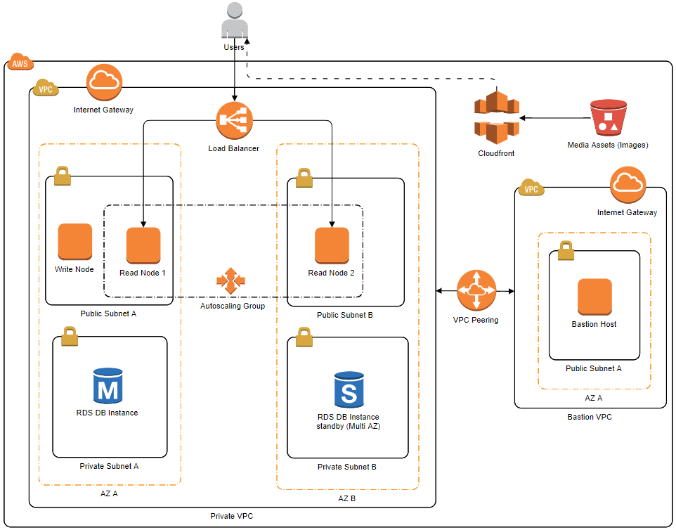

# wordpress aws automation

This project is designed to automate the creation of a Wordpress environment on AWS.

The architecture is similar to the wordpress setup found as part of the [AWS Certified Solutions Architecht-Associate course](https://acloud.guru/learn/aws-certified-solutions-architect-associate) provided by the acloudguru platform, however besides automating it, this project goes beyond by setting up VPCs for better security.

## Table of Contents  
[Architecture](#architecture)  
[Requirements](#requirements)  
[Usage](#Usage)  
<a name="architecture"/>
## Architecture

The architecture of your wordpress environment is highly customizable and can be set by updating the file generate_wordpress_stacks.py inside the modules folder
&nbsp;<a name="requirements"/>
## Requirements
* [Python3](https://www.python.org/downloads/)  
* [AWS CLI](https://docs.aws.amazon.com/cli/latest/userguide/cli-chap-welcome.html)  

The AWS CLI is an open source tool that enables you to interact with AWS services using commands in your command-line shell. Without going much into detail it is needed to store a valid **aws profile** on your computer that will be used for the wordpress deployment.

* [Troposphere](https://github.com/cloudtools/troposphere)  

Library used to generate CloudFormation templates
```powershell
$ pip install troposphere
```
* [Stacker](https://github.com/cloudtools/stacker)  

Tool and Library that orchestrate the creation and updates of CloudFormation stacks
```powershell
$ pip install --upgrade pip setuptools
$ pip install stacker
```
&nbsp;<a name="usage"/>
## Usage

Follow this sequence of steps to deploy your wordpress environment:

#### 1. Environment configuration


The file **modules/generate_wordpress_stacks.py** contains variables that define what your environment will look like. The following image shows an example of architecture that can be generated by this file



Things to note:

* A bastion VPC is created and peered with the private VPC to only enable SSH access to wordpress instances through the bastion host.
* Write Node = where you make changes to the website. e.g: add new posts.
* Read Nodes = the wordpress website. Read Nodes are part of an auto scaling group and behind a load balancer for high availability and traffic distribution.
* Once a minute, changes made to the website through the write node get uploaded to a S3 Bucket and read nodes download these changes to update the website.
* The database lives in a private VPC (without internet access) and can be configured for Multi-AZ.
* Cloudfront is used to deliver blog post images to users.


Most variables are self explanatory but I will highlight a few:

**stage** = defines the target environment. You can deploy multiple wordpress environments in the same account. e.g: prod, dev, test  
**key_name** = Key Pair that will be used. If you don't have a key yet go to the AWS console > EC2 > Key Pairs and generate your pair.  
**instance_ami** = Linux AMI for your instances. e.g: ami-009d6802948d06e52  

If you want to use the architecture shown in the image above you only need to change variables between **< >**


#### 2. Generate cloudformation stacks

Run the file **modules/generate_wordpress_stacks.py** to generate the cloudformation stacks.

```powershell
$ python .\modules\generate_wordpress_stacks.py
```

The cloudformation templates in yaml format can be found inside the **modules** folder

#### 3. Using Stacker to deploy the stacks

First, make sure you have an aws profile set on **~\.aws\credentials** that matches the profile name found inside the file **stacker/config/environments/prod.env**. e.g: default

Run stacker to deploy the stacks:  
```powershell
$ stacker build .\stacker\config\environments\prod.env .\stacker\config\config.yaml
```

To destroy the environment:
```powershell
$ stacker destroy .\stacker\config\environments\prod.env .\stacker\config\config.yaml --force
```

